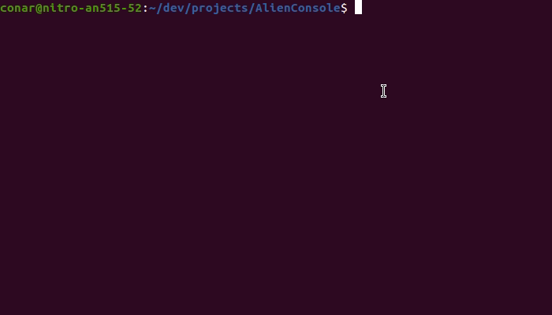

# Alien

Simple game written in C++11 using `ncurses` library.



## Instalation

1. Clone git repo
    ```sh
    $ git clone https://github.com/ilshat25/alien.git
    ```
2. Build the project
    ```sh
    $ make build
    ```
3. Run the game
    ```sh
    $ bin/main
    ```
 
## How to play

You need to break borders (symbol #) and pick up ammunition (symbol ◆) to get bullets.

### Controls

- <kbd>←</kbd> <kbd>→</kbd> <kbd>↑</kbd> <kbd>↓</kbd> change position
- <kbd>SPACE</kbd> shoot
- <kbd>Ctrl</kbd>+<kbd>C</kbd> exit game
